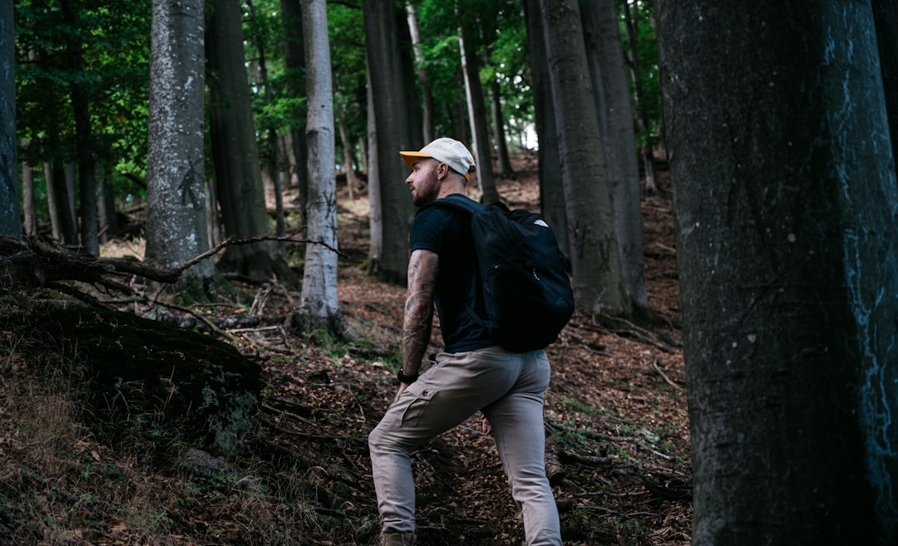

# **Why do we travel?**
There comes a point when the walls of your room begin to hum.  
Not loudly, not dramatically; just a quiet hum, the sound of repetitions. 
 
You’ve looked at the same corner for years, watched the same patch of sunlight shift across the floor, heard the same neighbours chattering. And then, one day, the air inside starts to feel stale, as if your lungs are full of a language that no longer belongs to you. *You don’t know where you want to go, only that you can’t stay.*

**It’s not wanderlust. That’s too glamorous a word.**  
**It’s restlessness. The dull ache of a mind that’s been still for too long.**

And so begins the small, private ritual: you look for solo travel vlogs of places you wished you were at. You'd watch someone visit and enjoy places you'd dreamed of. You're like a god trapped in his own cage, observing everything from above, but unable to experience it yourself.

*Sometimes it’s about distance.* 
*Sometimes it’s just about movement, any movement at all.* 

Because maybe what you really want isn’t another place.
**Maybe it’s another version of yourself.**

# **The Ancestry of Motion**
In the marrow of every human bone lies a whisper: *"**move**"*.
Before we knew how to build, we knew how to walk. 
*Migration was our first religion, hunger our first prophet.* 

Every step forward was *an act of faith*; faith that something existed beyond the horizon. The body has not forgotten this. 
The same blood that once pulsed through wandering tribes now rushes through your veins as you scroll through train tickets, searching for something you can’t quite name.

**Movement is survival disguised as curiosity.**

Even now, when everything we need can be delivered to our doorsteps, there’s still a pulse inside that wants to test the unknown. 
*To move is to reawaken the old muscles of wonder*; to let the senses re-learn the world. 

The smell of petrol at a station, the metallic taste of anticipation, the sound of luggage wheels over uneven tiles. 
They all remind you that you are not fixed, not cemented in place. 
**You are still made of atoms that vibrate.** 
**You are still allowed to change.**

# **The Psychology of Elsewhere**
For some, travel is about landscapes. 
For you, it’s about being somewhere else.
*Not escape from duty, but from identity.* 
The self can become claustrophobic when it’s been too long inside the same name, the same expectations. 
Every “good boy,” every “you’ve always been so calm,” every “you’ll figure it out” becomes another lock on the door.

But in another city, you are anonymous.  
No one knows your history, your face, your failures. 
**You could be anyone. You could be no one.**  
And that freedom, that erasure, is addictive.

You could walk into a café and order coffee without overthinking the tone of your voice. 
You could miss the bus and not have anyone roll their eyes at you.  
You could simply exist, unmeasured.

There is a strange joy in being invisible, and a stranger grief in needing that invisibility to breathe.  
You tell yourself it’s about adventure, but *it’s also about permission.*
**The permission to be someone who is not already accounted for.**

# The Childhood of Desire
When you were young, travel wasn’t about flights or passports.  
It was about leaving the narrow script of your life.
You dreamed of metro cities — Delhi, Mumbai, Bangalore — places where life seemed to hum louder, freer. 

You wanted to explore, to lose yourself in a crowd, to get scolded for being late, to go on trips that had no purpose except to exist in them. 
You wanted to live like those teenage boys who roamed the streets after school, their laughter bouncing off auto rickshaws and traffic lights.

But life didn’t unfold like that.  
Responsibility came early. Duty disguised itself as maturity. You became the perfect child — polite, quiet, high-performing. 
You learned to adjust, to shrink your wants into neat little boxes labeled _later_. 

But “later” kept slipping further away, until one day you looked around and realized that the boy who wanted to travel had become the man who forgot how to want.

And yet, that boy still whispers from the corner of your mind.  
He is the one who makes your heart ache when you see trains leaving stations.  
He is the one who asks, gently, “When will it be my turn?”

# The Philosophy Of Movement
To travel is to practice impermanence.  
Every step away from home is a small rehearsal of death. 
You shed your routines, your patterns, your self. 
In an unfamiliar place, you are forced to rebuild, moment by moment. 
The world strips you of certainty, and in that stripping lies renewal.

There’s a quiet truth you learn on long roads: you can’t escape yourself, but you can meet yourself differently. 
A foreign city doesn’t erase your sadness; it just rearranges it into a new geometry.  
The grief looks softer when it’s sitting beside a cup of chai on a balcony in another town. 
The loneliness feels lighter when it’s surrounded by unfamiliar languages.

Travel doesn’t fix you.  
It just lets you breathe in between the cracks of your own becoming.
And maybe that’s enough.

# The Paradox Of Home
Here’s the cruel joke: every traveler is also a returner.  
You leave because you must, and you return because you can’t help it. Home — the same walls, the same hum — waits like a quiet mirror, reflecting back all that’s changed in you. Sometimes the change is invisible to others. But you feel it. The way you now pause before speaking. The way you notice sunlight differently. The way you no longer rush through your days.

Home doesn’t change, but your gaze does.  
And perhaps that’s the entire point.

# The Modern Malaise
Today, travel has become another performance.  
People don’t go somewhere to disappear anymore — they go to be seen disappearing. Photos replace presence; itineraries replace intimacy. The journey becomes an aesthetic, not an awakening.

But even through this superficiality, the old longing remains. When you stand before the sea, no amount of Instagram captions can drown the silence that rises in your chest. The vastness always wins. The horizon always humbles you.

Because somewhere deep down, travel still feels sacred.  
Not because of where it takes you, but because of what it awakens: a sense of proportion. You are reminded of your smallness — and somehow, that smallness feels like peace.